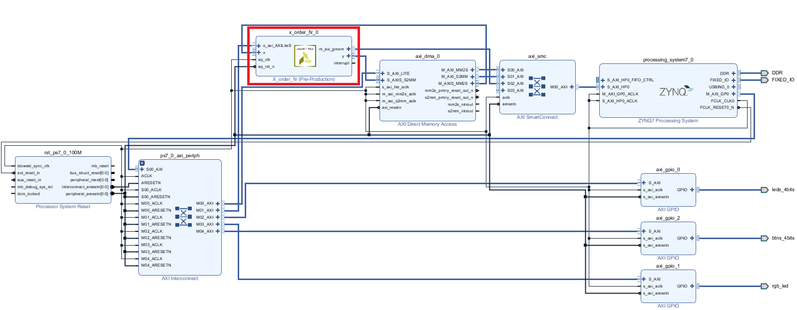

## PYNQ-x_filter

This repository contains a "X order FIR filter" (up to 1023 orders, both order and coefficients are configurable) introduction application to the Xilinx PYNQ framework and also the HLS source codes. 

You can go through the HLS source code to experience with the below HLS directives.

* m_axi

* axis

* s_axilite

* PIPELINE

* LOOP_TRIPCOUNT

The design illustrates how to run the X order FIR IP to filter the signal on the FPGA base on PYNQ framework and also illustrates the python *numpy* , *matplotlib* and *fftpack* packages. 

The below is the Vivado block design diagram.





## Quick Start

Open a terminal on your PYNQ board and run:

```
sudo pip3 install --upgrade git+https://github.com/louisliuwei/pynq_x_filter.git
or
sudo pip3 install --upgrade .
```

Currently this repository is compatible with [PYNQ image v2.4](http://www.pynq.io/board).


## Note

Only PYNQ-Z2 is supported by now. Migration to other boards are welcomed.
